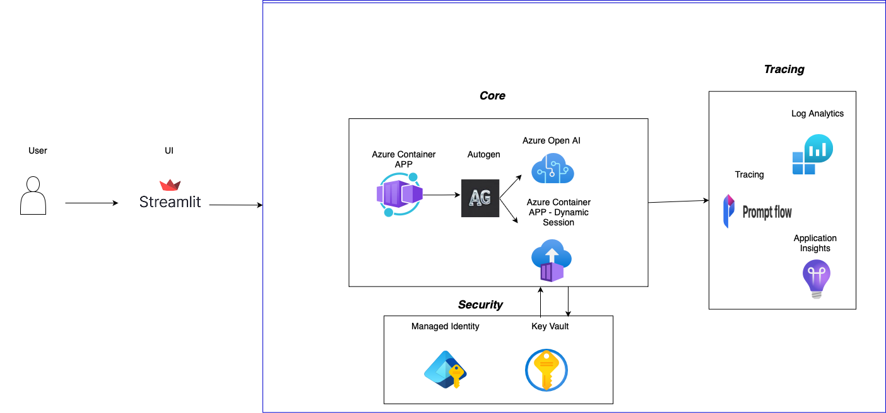
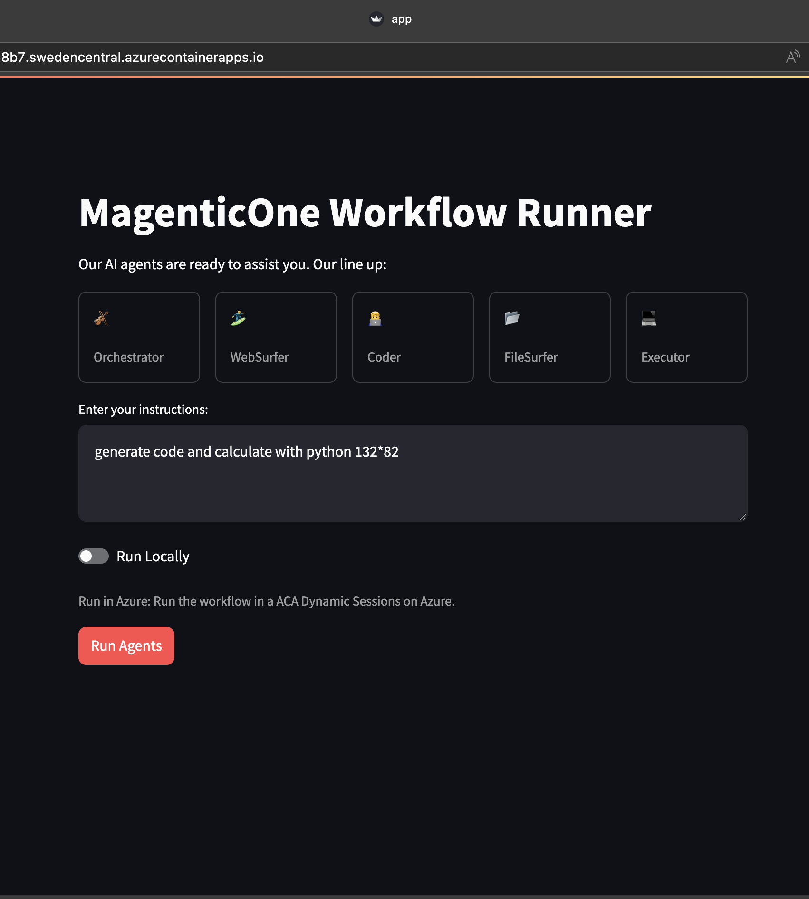

[](http://makeapullrequest.com)
[](https://www.linkedin.com/in/yaniv-vaknin-7a8324178/)

# Build your dream team with Autogen

This repository leverages Microsoft Autogen 0.4, Azure OpenAI and integrates it with Streamlit, to build an end to end multi agents application, this repo makes it easy to build test and deploy an advanced multi agent framework, based on [Magentic One](https://www.microsoft.com/en-us/research/articles/magentic-one-a-generalist-multi-agent-system-for-solving-complex-tasks/)
 



:tada: December 3, 2024: The repo now support one click deployment with [Azure Developer CLI](https://learn.microsoft.com/en-us/azure/developer/azure-developer-cli/), if you would like to run it with the full process localy you can check [v0.21](https://github.com/yanivvak/dream-team/tree/v0.21)

:tada: November 18, 2024: we are porting this repo to  [Autogen 0.4](https://microsoft.github.io/autogen/0.4.0.dev6/index.html), A new event driven, asynchronous architecture for AutoGen and [Magentic One](https://github.com/microsoft/autogen/tree/main/python/packages/autogen-magentic-one)

# Key Features

Dream Team offers the following key features:

- **Advanced multi agent framework**: this solution is based on the popular framework Autogen(35K stars) and Magentic One
- **Friendly UI**: easy way to build and share data apps powered by Streamlit
- **Single line deployment**: developer-friendly deployment that accelerates your path from a local development environment to Azure with single line of code - azd up.
- **Secure code execution**:  Fast access to secure sandboxed with strong isolation environments that are ideal for running code or applications with Azure Container Apps dynamic sessions.
- **Managed Identities**: Built in Azure Managed identities to eliminate the need for developers to manage these credentials
- **Observability & Debugging**: Built-in features and tools for tracking, tracing, and debugging agent interactions and workflows, including PromptFlow tracing.


# Prerequisites:

1. Install [Azure Developer CLI](https://learn.microsoft.com/en-us/azure/developer/azure-developer-cli/install-azd?tabs=winget-windows%2Cbrew-mac%2Cscript-linux&pivots=os-windows).
2. Ensure you have access to an Azure subscription
3. Docker - Follow the [official Docker installation instructions](https://docs.docker.com/get-started/get-docker/)
4. Python version >= 3.8, < 3.13

# Step by step deployment
   
## 1. Clone the repository     
```bash  
git clone https://github.com/Azure-Samples/dream-team  
```
## 2. Login to your Azure account
```bash
azd auth login
```
> You need to choose your preferred region (you can start with east us or sweden central or any other available region)
## 3. Deploy Azure Resources and the app
```bash
azd up
```

# Working locally  
```bash  
cd src 
```

Set up a virtual environment (Preferred)
```bash
python -m venv dream
```
Once you’ve created a virtual environment, you may activate it.

On Windows, run:
```bash
dream\Scripts\activate
```
On Unix or MacOS, run:
```bash
source dream/bin/activate
```
To deactivate :
```bash
deactivate
```
> More information about virtual environments can be found [here](https://docs.python.org/3/tutorial/venv.html)

 
## Install dependencies
```bash
pip install -r requirements.txt
```
```bash
git clone --depth 1 --branch v0.4.0.dev11 https://github.com/microsoft/autogen.git
cd autogen/python/packages/autogen-magentic-one
pip install -e .
```

```bash
playwright install --with-deps chromium
```

## Update configuration

   - Navigate to src folder
```bash
cd ../../../..
```
   - If you used AZD to deploy the resources just run the code below
   ```bash
   azd env get-values > .env
   ```` 
   - Alternatively, copy `.env.sample` (under src) into `.env`

> Important: Magentic-One code uses code execution, you need to have Docker installed to run the examples if you use local execution

## Run
```bash
streamlit run app.py
```
If your app is ready, you can browse to (typically) http://localhost:8501 to see the app in action.


# Learn
Check these resources:
1. [Blogpost](https://techcommunity.microsoft.com/blog/Azure-AI-Services-blog/build-your-dream-team-with-autogen/4157961) - Build your dream team with Autogen
2. [Webinar](https://youtu.be/wB9gD9FkgNA?si=WU3H0QL37RCiTGvl) - More agents is all you need
